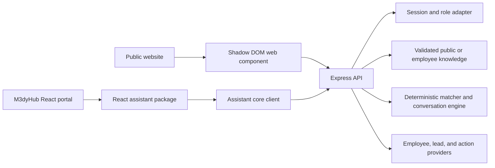

# Medy Assistant

Medy Assistant is a locally runnable deterministic stakeholder-demo assistant for SecureMedy. It contains a standalone public-site widget, a reusable React employee assistant, a mock M3dyHub portal, a typed Express API, validated structured knowledge, deterministic intent matching, session conversation state, and presentation controls. It does not use an external language model and is not described as trained. All included people and records are fictional.

## Start locally

Requirements: Node.js 20+ and npm.

```powershell
cd <this-repository>
npm install
npm run dev
```

The root development command explicitly enables `DEMO_MODE=true`. Employee requests require one of the provisioned fictional session identifiers; the demo frontend uses `stakeholder-demo`. This is fail-closed demonstration identity, not production authentication.

Open `http://localhost:5180`. The API uses `http://localhost:4180`; its health endpoint is `http://localhost:4180/api/health`. Port 5180 deliberately avoids another Vite application on port 5173.

Useful routes:

- `/` — public-site demonstration and isolated assistant widget
- `/employee/dashboard` — fictional M3dyHub dashboard
- `/employee/assistant` — full employee assistant workspace
- `/admin/leads` — locally captured demonstration leads
- `/control` — role, error/delay simulation, action log, and reset controls

## Verification

```powershell
npm run lint
npm run format:check
npm run typecheck
npm test
npm run build
npm run test:e2e
```

Unit/integration tests cover deterministic matching, contextual field collection, API hardening, domain separation, role authorization, emergency handling, safe fallback, knowledge status, anti-fabrication boundaries, audit records, reset, and XSS-safe rendering. Chromium journeys cover multi-turn public and employee conversations, lead intake, responsive behavior, roles, and Shadow DOM isolation.

Playwright uses dedicated ports 4281 and 5281, refuses to reuse existing servers, and creates lead/action files in a temporary operating-system directory. Acceptance tests therefore do not write to repository data files.

To run the built API directly:

```powershell
npm run build
npm run start --workspace apps/api
```

## Architecture



- `packages/shared-types` owns Zod contracts, action types, roles, modes, and centralized portal routes.
- `packages/assistant-core` owns the API client and navigation adapters.
- `packages/assistant-react` is the reusable employee/floating React UI used by the demo.
- `packages/assistant-widget` is the framework-independent public custom element used by the demo.
- `apps/api` owns security middleware, the deterministic conversation engine, structured knowledge, and local data providers.
- Public and employee entries are separate validated retrieval scopes.

API input, knowledge entries, and assistant output are runtime-validated. Helmet, constrained CORS, request limits, rate limiting, role checks, and safe text rendering are enabled. Mock write actions require confirmation in the React UI and produce audit records.

## Public widget integration

Load the built widget script, then place the custom element on the public site:

```html
<script type="module" src="https://cdn.example/medy-assistant.js"></script>
<medy-assistant data-api-url="https://assistant-api.example/api"></medy-assistant>
```

The component uses an open Shadow DOM root so ordinary host CSS does not leak into it. Production hosting should constrain the API origin, apply a CSP, pin/cache versioned assets, and complete an accessibility and security review.

## M3dyHub React integration

```tsx
import { MedyAssistant } from "@medy/assistant-react";
import { ReactRouterNavigationAdapter } from "@medy/assistant-core";

<MedyAssistant
  mode="employee"
  apiUrl="/api"
  sessionId={authoritativeSessionId}
  user={currentUser}
  navigation={new ReactRouterNavigationAdapter(navigate)}
  variant="workspace"
/>
```

Replace the mock session adapter with M3dyHub's server-validated identity and claims. Replace employee-data providers with authenticated M3dyHub adapters. Update the one route map in `packages/shared-types` if production portal paths differ.

## Deterministic knowledge system

The assistant uses no OpenAI, Amazon Bedrock, or other external language model. `apps/api/src/knowledge.ts` contains Zod-validated entries with source status, workflow fields, warnings, disclaimers, actions, and escalation ownership. `apps/api/src/conversation.ts` performs normalized deterministic matching, weighted synonyms and examples, contextual field collection, emergency precedence, and safe fallback logging.

## API summary

- `POST /api/chat` — validated public or employee assistant exchange
- `POST /api/leads`, `GET /api/leads`, `GET /api/leads/:id` — local demonstration lead flow
- `GET /api/demo/employee/*` — fictional employee profile, requests, training, approvals, uniform, equipment, leave, and license data
- `POST /api/demo/actions/:type` — allowlisted role-aware mock actions
- `GET|POST /api/demo/config` — presentation configuration
- `GET /api/demo/actions` — audit log
- `POST /api/demo/reset` — reset local leads, actions, and mock session state

## Troubleshooting

Lead administration, action audit access, configuration, provider/error controls, role switching, and reset are available only when `DEMO_MODE=true`. This flag is a deployment safety gate, not authorization.

- If npm tries to write under `C:\Windows\System32`, the terminal is in the wrong directory. Change to this repository before running npm.
- If port 5180 or 4180 is occupied, change the configured Vite/API port and `VITE_API_URL` together.
- If browser tests cannot launch Chromium, run `npx playwright install chromium` once.

## Production boundaries and limitations

This repository does not contain production M3dyHub authentication, live employee data, a CRM, durable database, email/SMS, emergency dispatch, or approved SecureMedy policy content. Employee endpoints require an explicitly provisioned fictional session (`stakeholder-demo`, `demo-officer`, `demo-manager`, or `demo-hr-admin`), but these identifiers are not production credentials. Local JSON persistence and demo-session identity are demonstration mechanisms only. Production requires privacy and security review, authoritative authentication/authorization, encrypted durable storage, retention/deletion controls, secrets management, monitoring, WAF/abuse protection, accessibility testing, deterministic-rule evaluation, human escalation, disaster recovery, and penetration testing.

The requested reference HTML, Word, and PDF assets were not present in the supplied workspace. Their absence and the resulting design limitation are documented in `docs/reference/README.md` and `docs/architecture/REFERENCE_FINDINGS.md`; no claim of exact reference parity is made.
